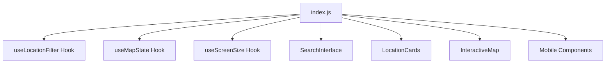
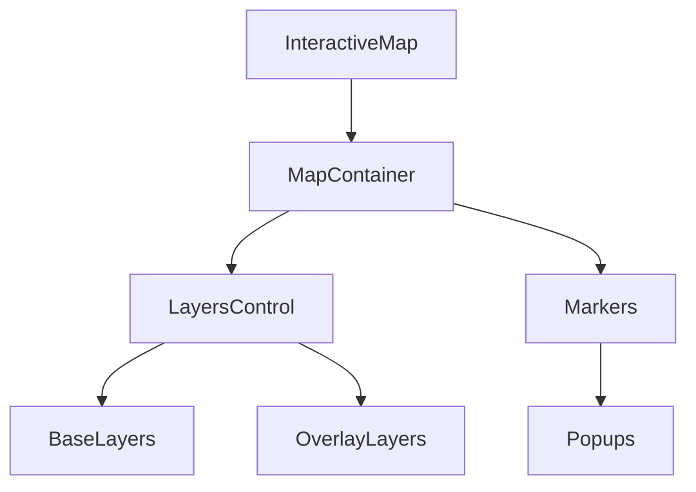
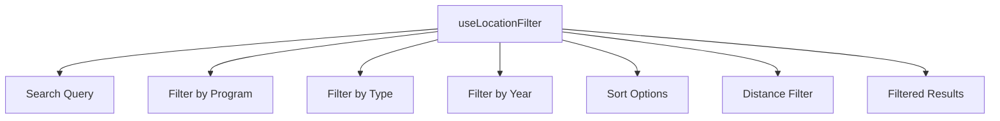
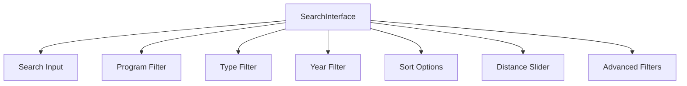
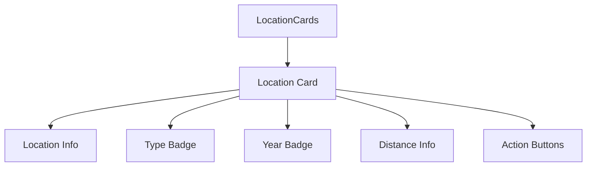
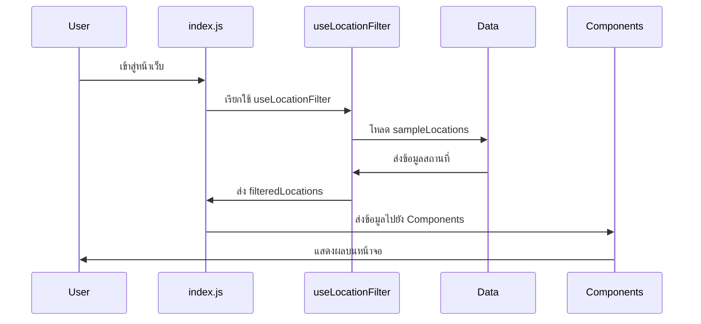
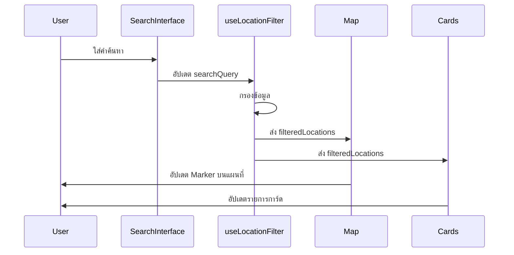
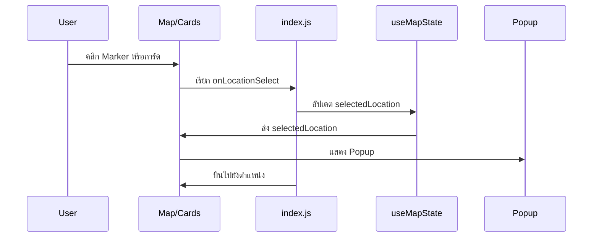
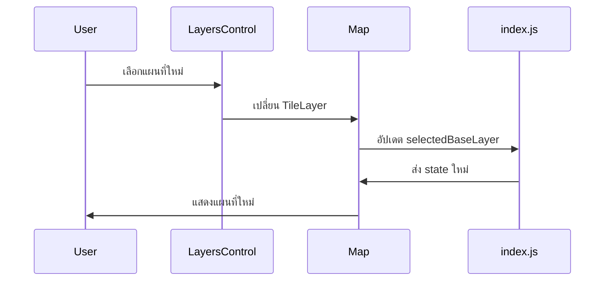

# Context และ Flow ของ Component - ระบบแผนที่แบบ Interactive

## 📋 ภาพรวมของระบบ

ระบบนี้เป็นแอปพลิเคชันแผนที่แบบ Interactive ที่ใช้ Next.js, React-Leaflet และ Tailwind CSS เพื่อแสดงข้อมูลสถานที่ต่างๆ ในจังหวัดตรัง ประเทศไทย พร้อมฟีเจอร์ค้นหา กรอง และเลือกแผนที่หลายแบบ

## 🏗️ โครงสร้าง Component หลัก

### 1. **pages/index.js** - หน้าหลัก


**หน้าที่:**
- จัดการ State หลักของแอปพลิเคชัน
- เชื่อมต่อ Hook ต่างๆ เข้าด้วยกัน
- จัดการ Responsive Design
- ส่งต่อ Props ไปยัง Component ย่อย

**State ที่สำคัญ:**
- `selectedBaseLayer` - เลือกแผนที่ฐาน
- `selectedOverlays` - เลือกแผนที่ซ้อนทับ
- `showLocationCard` - แสดงการ์ดสถานที่
- `showFilter` - แสดงตัวกรอง

### 2. **components/map/interactive-map.js** - แผนที่หลัก


**หน้าที่:**
- แสดงแผนที่แบบ Interactive
- จัดการ Layer Control (เปลี่ยนแผนที่)
- แสดง Marker ของสถานที่
- จัดการ Popup เมื่อคลิก Marker

**Props ที่รับ:**
- `locations` - รายการสถานที่
- `selectedLocation` - สถานที่ที่เลือก
- `onLocationSelect` - ฟังก์ชันเมื่อเลือกสถานที่
- `selectedBaseLayer` - แผนที่ฐานที่เลือก
- `selectedOverlays` - แผนที่ซ้อนทับที่เลือก

### 3. **hooks/useLocationFilter.js** - Hook สำหรับกรองข้อมูล


**หน้าที่:**
- กรองข้อมูลสถานที่ตามเงื่อนไขต่างๆ
- จัดการการค้นหา
- จัดการการเรียงลำดับ
- สร้างสถิติการกรอง

**Filter Options:**
- **Search**: ค้นหาตามชื่อและคำอธิบาย
- **Program**: กรองตามโปรแกรม
- **Type**: กรองตามประเภทสถานที่
- **Year**: กรองตามปีที่ก่อตั้ง
- **Distance**: กรองตามระยะทาง
- **Sort**: เรียงลำดับตามเกณฑ์ต่างๆ

### 4. **components/search/search-interface.js** - หน้าต่างค้นหา


**หน้าที่:**
- แสดงฟอร์มค้นหาและกรอง
- จัดการ Advanced Filters
- แสดงสถิติการกรอง
- ปุ่ม Clear Filters

### 5. **components/cards/location-cards.js** - การ์ดสถานที่


**หน้าที่:**
- แสดงรายการสถานที่ในรูปแบบการ์ด
- แสดงข้อมูลสำคัญของแต่ละสถานที่
- จัดการการเลือกสถานที่
- แสดง Badge สำหรับประเภทและปี

## 🔄 Flow การทำงานของระบบ

### 1. **Flow การโหลดข้อมูล**


### 2. **Flow การค้นหาและกรอง**


### 3. **Flow การเลือกสถานที่**


### 4. **Flow การเปลี่ยนแผนที่**


## 🎯 ปัญหาที่พบและวิธีแก้ไข

### 1. **ปัญหา SSR (Server-Side Rendering)**
**ปัญหา:** Leaflet components ไม่สามารถ render บน server ได้
**สาเหตุ:** Leaflet ต้องการ `window` object ที่มีเฉพาะใน browser
**วิธีแก้:**
- ใช้ `"use client"` directive
- ใช้ `dynamic` import พร้อม `ssr: false`
- เพิ่ม `isClient` state check
- ย้าย Leaflet icon configuration ไปใน `useEffect`
- ใช้ dynamic import สำหรับ `InteractiveMap` ใน `pages/index.js`

**Code Example:**
```javascript
// ใน pages/index.js
const InteractiveMap = dynamic(
  () => import("../components/map/interactive-map"),
  { ssr: false }
)

// ใน interactive-map.js
useEffect(() => {
  setIsClient(true);
  
  // Fix for default markers in Leaflet - only run on client side
  if (typeof window !== 'undefined') {
    import('leaflet').then((L) => {
      delete L.default.Icon.Default.prototype._getIconUrl;
      L.default.Icon.Default.mergeOptions({
        iconRetinaUrl: 'https://cdnjs.cloudflare.com/ajax/libs/leaflet/1.7.1/images/marker-icon-2x.png',
        iconUrl: 'https://cdnjs.cloudflare.com/ajax/libs/leaflet/1.7.1/images/marker-icon.png',
        shadowUrl: 'https://cdnjs.cloudflare.com/ajax/libs/leaflet/1.7.1/images/marker-shadow.png',
      });
    });
  }
}, []);
```

### 2. **ปัญหา Marker Icons หาย**
**ปัญหา:** 404 error สำหรับ marker icons
**สาเหตุ:** Default Leaflet icons ไม่ถูกโหลด
**วิธีแก้:**
- กำหนด CDN URLs สำหรับ icons
- ใช้ `L.Icon.Default.mergeOptions()`

### 3. **ปัญหา Element Type Invalid**
**ปัญหา:** `LayersControl.BaseLayer` และ `LayersControl.Overlay` เป็น undefined
**สาเหตุ:** Dynamic import ไม่สามารถเข้าถึง nested components ได้
**วิธีแก้:**
- สร้าง separate dynamic imports
- ใช้ `LayersControlBaseLayer` และ `LayersControlOverlay`

## 📊 ข้อมูลที่ใช้ในระบบ

### **sampleLocations** (data/location.js)
```javascript
{
  id: number,
  name: string,
  address: string,
  coordinates: [lat, lng],
  type: string,
  programs: string[],
  description: string,
  year: number,
  establishedYear: number,
  distance: string
}
```

**ข้อมูลสถานที่ในจังหวัดตรัง:**
- ศูนย์บริการประชาชนจังหวัดตรัง
- มหาวิทยาลัยราชภัฏตรัง
- ตลาดนัดตรัง
- โรงพยาบาลตรัง
- ศูนย์ฝึกอาชีพตรัง
- ศูนย์พัฒนาอาชีพตรัง
- สถาบันการท่องเที่ยวตรัง
- ศูนย์เชื่อมโยงงานตรัง
- โรงเรียนช่างตรัง
- ศูนย์แก้ปัญหาการจ้างงานตรัง
- ศูนย์ชุมชนตรัง
- ศูนย์ทักษะตรัง

### **tileLayers** (lib/title-layer.js)
```javascript
{
  baseLayers: {
    OpenStreetMap: { url, attribution, name },
    CartoDB_Positron: { url, attribution, name },
    CartoDB_Dark: { url, attribution, name },
    Stamen_Terrain: { url, attribution, name }
  },
  overlayLayers: {
    OpenStreetMap_Overlay: { url, attribution, name, opacity },
    Satellite: { url, attribution, name, opacity }
  }
}
```

## 🚀 ฟีเจอร์ที่พร้อมใช้งาน

### ✅ **ฟีเจอร์ที่เสร็จสมบูรณ์**
- [x] แผนที่แบบ Interactive
- [x] ระบบค้นหาและกรอง
- [x] Multiple Tile Layers
- [x] Location Cards
- [x] Responsive Design
- [x] Mobile Support
- [x] Marker Icons
- [x] Popup Information

### 🔄 **ฟีเจอร์ที่สามารถขยายได้**
- [ ] Real-time Data
- [ ] User Authentication
- [ ] Favorites System
- [ ] Route Planning
- [ ] Advanced Filters
- [ ] Export Data
- [ ] Analytics Dashboard

## 🛠️ เทคโนโลยีที่ใช้

- **Frontend:** Next.js, React, Tailwind CSS
- **Maps:** Leaflet, React-Leaflet
- **State Management:** React Hooks
- **Icons:** Lucide React
- **Responsive:** react-screen-size-helper
- **Styling:** Tailwind CSS

## 📱 Responsive Design

- **Mobile:** < 768px - แสดง MobileHeader, MobileBottomSheet
- **Tablet:** 768px - 1024px - แสดง SearchInterface, LocationCards
- **Desktop:** > 1024px - แสดง Header, SearchInterface, LocationCards
- **Large Desktop:** > 1440px - Layout เต็มรูปแบบ

---

*เอกสารนี้อัปเดตล่าสุด: วันที่สร้างเอกสาร*
